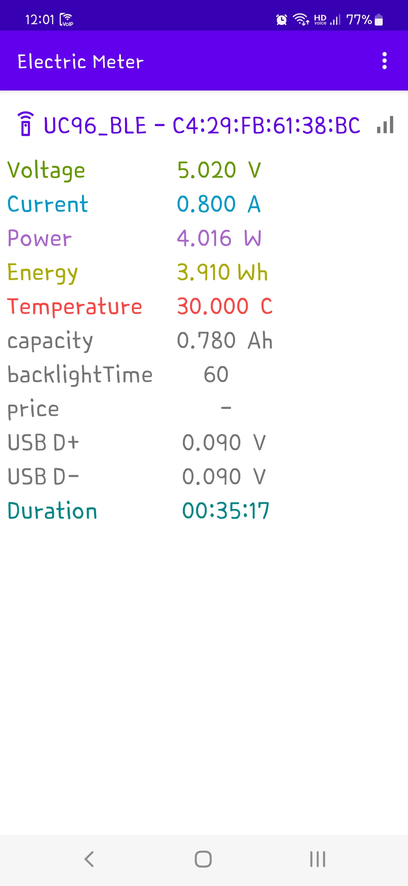
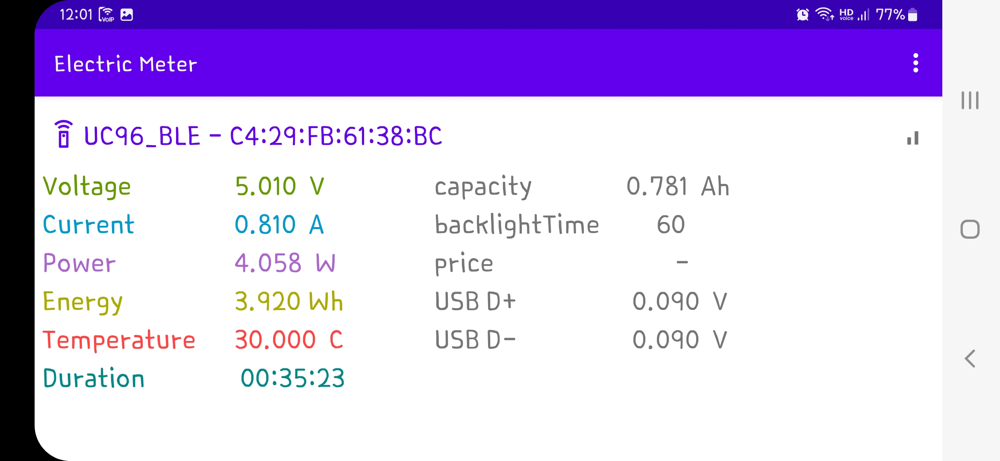

# Eletric Meter

Android application for Atorch BLE device

## How to use

## ScreenShot
 

!Settings(settings_Electric_Meter.jpg)

## Download
TBD

##

## Reference
- <https://github.com/NiceLabs/atorch-console>
- <https://github.com/msillano/UD18-protocol-and-node-red>
